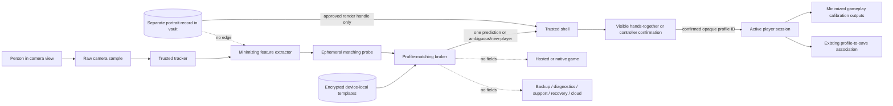

# Automatic body-profile matching threat model

Status: camera-free research contract implemented; product feature not
implemented or approved for household beta

Last reviewed: 2026-07-24

Scope: I-184, D-079, D-080, D-084, D-085, and D-086

## Overview

VCG plans to predict which persisted local calibration profile belongs to a
person by comparing newly observed body or movement features with
device-local reference templates. This is one-to-many recognition of a
person, even though the result is only a convenience prediction and not
authentication. Treat every sample, derived probe, template, candidate list,
score, and linkage as sensitive biometric-like data.

This document is a feature-specific companion to
[SECURITY_THREAT_MODEL.md](SECURITY_THREAT_MODEL.md). It does not replace that
repository-wide model, prove that a mitigation exists, qualify a vault, or
provide legal advice. The current browser prototype does not implement
persistent body-profile matching. A separate strict TypeScript research
contract now exercises a fixed synthetic body-ratio vector, conservative
prediction/abstention, exact one-shot confirmation, correction, New Player,
and opt-out while granting no downstream authority. Its ten camera-free
scenarios use no people, images, vault, extractor, or persistence and do not
qualify the feature. See
[BODY_PROFILE_PREDICTION_EVIDENCE_2026-07-24.md](BODY_PROFILE_PREDICTION_EVIDENCE_2026-07-24.md).
All controls marked "required" remain release gates rather than present-tense
product claims.

The acceptable product result is deliberately narrow:

- matching is optional convenience, not identity proof or authorization;
- the shell visibly presents a prediction and requires a separate deliberate
  hands-together or controller confirmation before applying any profile;
- no calibration, accessibility setting, save, score, or profile authority is
  exposed before confirmation;
- explicit profile selection and transient calibration provide complete
  gameplay without enrollment or matching;
- portraits and facial features never enter the matching pipeline;
- samples and templates remain on one console and never enter backup, export,
  cloud, diagnostics, support, recovery, game, or developer data paths; and
- deleting a profile removes its matching material and identity links without
  deleting its game progress, which becomes unassigned.

### Assets and sensitivity

| Asset | Why it matters | Required treatment |
|---|---|---|
| Raw camera frame or tracker sample | Contains household imagery and potentially bystanders | Volatile capture-path memory only; no new persistence or egress edge |
| Landmark sequence | Can reveal body shape, movement, range, and accessibility characteristics | Minimized to the matching window; unavailable to the profile UI, games, logs, and support |
| Matching probe | Technically processed feature vector used to single out a person | Sensitive even if no match occurs; memory-only and destroyed after one attempt |
| Enrolled template | Persistent biometric-like reference associated with an opaque profile ID | Encrypted device-local vault only; least-privilege broker access |
| Candidate IDs, ranks, scores, thresholds | Can reveal household membership and support oracle attacks | Broker-internal and session-bounded; UI receives one coarse prediction or ambiguity state |
| Profile name and portrait | Directly identifies a household profile to people in the room | Separate storage and rendering path; never scorer input |
| Calibration and accessibility values | May imply stature, mobility, disability, or usable range | Vault-protected; released only after confirmed profile selection and only as minimized gameplay outputs |
| Console-bound vault key | Loss exposes or permanently destroys every protected profile record | Hardware-backed where qualified; never exportable, logged, backed up, or silently replaced |
| Consent, notice, and deletion state | Proves whether processing is allowed and when it must stop | Exact local policy state with fail-closed schema and lifecycle; design remains open |

### Planned data flow

The extractor and broker are trusted native components, not browser game
code. The broker receives the smallest fixed feature vector that testing and
legal review approve. The shell receives no vector, full candidate list,
distance, raw score, or threshold. Games receive only an opaque active-player
session identity and separately granted gameplay calibration outputs after
confirmation.

### Retention and destruction model

| Data | Earliest creation | Maximum intended lifetime | Destruction event | Forbidden copies |
|---|---|---|---|---|
| Raw frame | Camera capture | Existing inference lifetime only | Frame consumed, dropped, capture stopped, or fault | Files, browser stores, IPC payloads, logs, crash evidence, network |
| Matching landmark window | Tracker output | One bounded prediction attempt | Result, cancellation, timeout, tracker reset, or fault | Shell, games, diagnostics, support, persistent queues |
| Probe/vector | Feature extraction | One broker request | Comparison result, cancellation, timeout, or fault; memory clearing must be tested | Vault, logs, scores UI, game IPC, exports |
| Reference template | Explicit enrollment after notice/consent | Until profile matching is disabled for that profile, profile deletion, factory reset, key loss, or a shorter legally required limit | Crash-recoverable vault deletion | Backup, migration, recovery copy, saves, diagnostics, cloud |
| Prediction and confidence | Comparison | Current selection screen only | Confirm, choose another profile/New Player, cancel, timeout, or restart | Durable history, telemetry, diagnostics, game IPC |
| Aggregate quality counters | Local qualification build only | Bounded test run under a reviewed evidence protocol | Evidence deletion schedule | Profile IDs, names, raw values, small-cell household results |

No "anonymous" or "irreversible" claim is justified merely because a vector
does not resemble an image. A body or motion template remains linkable if it
distinguishes a returning person, and it may support inference about height,
proportions, gait, mobility, or disability. Red-team work must attempt
template inversion, membership inference, linkage across sessions, linkage
across consoles, and reconstruction of protected attributes before the
feature can advance.

## Threat Model, Trust Boundaries, and Assumptions

### Security and privacy objectives

1. A profile prediction never grants authority and cannot silently select a
   person's saves, settings, score history, portrait, or calibration.
2. A person can use every core local game without enrollment, a persisted
   template, or a portrait.
3. Matching material cannot leave the device through an intended product
   path and cannot be read from removed ordinary storage.
4. A game, hosted origin, diagnostics path, support workflow, update image,
   recovery environment, or ordinary developer client cannot enumerate or
   query matching records.
5. Deletion is complete, crash-recoverable, and cannot be undone by rollback,
   save restoration, name reuse, portrait similarity, or profile-ID reuse.
6. Failure is visible and falls back to explicit selection or New Player; it
   never lowers a threshold or falls back to plaintext storage.
7. The system does not describe matching as authentication or as a factual
   statement of identity.

### Trust boundaries

| Boundary | Trusted side | Untrusted or less-trusted side | Required control |
|---|---|---|---|
| TB-1 Camera to tracker | Reviewed capture/tracker process | Camera firmware, USB transport, physical scene | Exact device/mode qualification, bounded buffers, no microphone, malformed-frame handling |
| TB-2 Tracker to extractor | Fixed native schema and feature allowlist | Provider-specific rich landmarks and metadata | Closed schema, range/finite checks, minimization, version binding |
| TB-3 Extractor to broker | One ephemeral probe | Shell, games, diagnostics, other local processes | Authenticated local IPC, caller identity, message cap, no general query API |
| TB-4 Broker to vault | Narrow profile broker | Writable storage, removed/cloned card, rollback | AEAD records, console-bound protected key, anti-substitution/rollback design, no plaintext fallback |
| TB-5 Broker to shell | One coarse result | UI code and anyone viewing the TV | No vector/rank/score; generic ambiguity; bounded attempts; visible confirmation |
| TB-6 Shell to game session | Confirmed opaque session identity | Hosted/native/retro game | Versioned projection and sandbox; no vault, portrait, candidate, or policy methods |
| TB-7 Profile lifecycle | Crash-recoverable profile service | Browser requests and credential-free household users | Exact preview/confirmation, scope binding, idempotent deletion, no body-match authentication |
| TB-8 Maintenance and evidence | Image/update/recovery/support services | Artifacts that may be copied off-device | Automated negative content inspection and deny-by-default mounts/APIs |
| TB-9 Build and update | Signed reviewed extractor/broker/model | Dependencies, models, packages, developer builds | Reproducible inventory, signed system boundary, compatibility/version gates |

The browser main thread, worker, and same-origin code are not separate
security principals. A native process name or filesystem permission alone is
also not sufficient isolation. The production design needs qualified
operating-system identities, sandbox/mount rules, authenticated IPC, and a
single broker allowed to unseal matching records.

### Actors and capabilities

- A cooperative household member can deliberately enroll, confirm, correct,
  disable, reset, or delete profiles.
- A curious or hostile sibling/guest has physical access, can stand before
  the camera, operate ordinary controls, and observe the TV. Under D-086 this
  person may deliberately manage profiles after explicit confirmation; the
  system is not designed to authenticate family administrators.
- A malicious hosted page or game controls its own content, network requests,
  storage, and process behavior but must not possess profile-broker authority.
- A compromised ordinary local process may read its own files and IPC and try
  confused-deputy, path, timing, enumeration, or resource-exhaustion attacks.
- A removable-storage attacker can power off the console, clone or modify the
  card, and compare snapshots, but does not possess invasive access to a
  qualified hardware root or a running unlocked console.
- A developer/root attacker can inspect plaintext in a running system. The
  automatically unlocked vault does not protect against a fully compromised
  trusted runtime; signed boot, least privilege, process isolation, and
  incident response reduce but do not remove that risk.
- A supply-chain attacker may modify a tracker, model, dependency, build
  artifact, update, or recovery image.
- A person in the room may use clothing, posture, replayed imagery, another
  person, or coordinated movement to induce a false result.

### Assumptions and non-goals

- Matching is one-to-many prediction for convenience. It is never proof that
  the person is the profile owner.
- The threat model does not protect a profile from a physically present
  household user who deliberately completes the credential-free deletion
  confirmation. It must protect against accidental motion, hidden remote/game
  actions, confused scope, and incomplete deletion.
- The vault protects data at rest on removable storage. It cannot keep data
  secret from arbitrary code already executing with broker or root authority
  while the vault is open.
- Console replacement, destructive reflash, storage loss, or protected-key
  loss destroys matching profiles. There is no recovery or migration copy.
- Local-only processing reduces propagation but does not by itself eliminate
  biometric, child-privacy, consumer-protection, notice, consent, retention,
  or security obligations.

### Fail-closed invariants

- No approved notice/consent state: no enrollment and no probe creation.
- No exact feature-schema/model/version match: no comparison.
- Vault key unavailable, record invalid, rollback suspected, or broker
  unhealthy: no matching and no plaintext reconstruction.
- No confident unambiguous result: present New Player or explicit selection,
  not the "closest" identity.
- Prediction unconfirmed: no profile-bound data or authority.
- Matching disabled or consent withdrawn: stop future probes and delete the
  persisted template through the same durable lifecycle as profile deletion.
- Portrait rendering and body matching have no shared feature, model, cache,
  database, or fallback path.
- No network state, account, or hosted service changes matching behavior.

## Attack Surface, Mitigations, and Attacker Stories

### Attacker-story register

| ID | Attacker story and impact | Required mitigation | Proof before beta |
|---|---|---|---|
| BM-01 | A game or hosted origin calls a broad profile API to enumerate household members or retrieve templates. | Broker accepts a closed operation set only from authenticated host principals; games have no profile methods or vault mount. | Hostile web/native/retro conformance tests and syscall/IPC trace |
| BM-02 | A malicious caller repeatedly submits probes and observes scores, ranks, timing, or different errors as a household-membership oracle. | No external score/rank/candidate list; one coarse result; constant-shape errors; bounded session attempts; audit only nonidentifying counters. | Enumeration, timing, error-shape, and rate-limit tests |
| BM-03 | A removed or cloned card reveals templates, names, portraits, or correlations between encrypted records. | Console-bound nonpublic key, AEAD, opaque record names, padding/bucketing where needed, no plaintext temp/swap/crash path. | Target storage extraction, clone, snapshot-diff, swap, crash, and cold-boot review |
| BM-04 | Storage rollback revives a deleted profile or an old template. | Bind vault generation/deletion state to qualified protected state; fail closed on rollback or substitution; never infer deletion from registry absence alone. | Delete/rollback/power-loss/card-clone adversarial matrix |
| BM-05 | A false match reveals a person's profile name/portrait or applies another person's accessibility calibration, saves, or scores. | Coarse/ambiguous result, visible prediction, mandatory separate deliberate confirmation, no authority before confirmation, easy correction/New Player. | Stratified false-accept/false-reject trials and UI observation review |
| BM-06 | Similar bodies, children, seated players, mobility changes, clothing, assistive devices, or camera changes produce unequal errors or unsafe calibration. | Separate cohort gates, abstention thresholds, stale-template invalidation, no silent normalization, controller and transient calibration fallback. | Pre-registered household/accessibility test matrix with confidence intervals |
| BM-07 | A portrait, face embedding, or raw crop silently improves matching and expands legal/privacy exposure. | Separate code, model, store, IPC, and dependency graph; feature allowlist rejects facial landmarks and image fields. | Static dependency/data-flow test plus sentinel portrait/face-field rejection |
| BM-08 | Logs, diagnostics, crash dumps, telemetry, support bundles, recovery images, or A/B slots copy sensitive material. | No matching values in logging types; vault excluded by mount and artifact policy; memory/crash policy; content scanners use seeded canaries. | I-186 automated negative-leak suite across every named path |
| BM-09 | A local developer or support flow enables matching, exports data, or weakens thresholds without the household noticing. | Developer mode cannot alter family policy silently; configuration is signed/versioned; local UI shows test-only state; release build omits raw inspection surfaces. | Mode-transition, release-build, config-tamper, and artifact-diff tests |
| BM-10 | A person withdraws consent or deletes a profile, but caches, probes, old generations, saves, or profile-name recreation reassociate it. | One durable deletion transaction covers template/calibration/portrait links; probes/caches expire; saves become unassigned; opaque IDs never reused. | Interruption at every deletion boundary, rollback, recreation, and forensic search |
| BM-11 | Vault-key loss causes the system to recover from a public identifier, stale copy, or plaintext fallback. | Treat loss as destructive; clearly offer fresh profile creation while leaving unrelated saves unassigned. | TPM/secure-element reset, corrupt key, replaced board, and missing-key tests |
| BM-12 | Crafted landmarks, NaN/range abuse, oversized sequences, model output, or concurrent probes crash the broker or cross profiles. | Closed bounded schema, finite/range checks, one request per session/person, isolation, deterministic timeouts, memory caps. | Property/fuzz/concurrency tests with sanitizers on target architectures |
| BM-13 | A compromised tracker/model creates covert identifying output or network egress. | Pinned reviewed artifacts, signed system update, network-denied process, fixed output schema, reproducible inventory. | Dependency/model hash verification, sandbox network tests, release SBOM review |
| BM-14 | A sibling accidentally waves through a destructive profile action or a game synthesizes its confirmation. | Profile management uses a distinct preview, exact scope, deliberate reserved-input confirmation, and cancellation; game-origin input cannot confirm. | Accidental-motion, held-input, replay, focus, remote-origin, and power-loss tests |
| BM-15 | A bystander who never enrolled is probed merely by entering the camera view. | Matching begins only in a visible join/selection flow after applicable notice and consent; ordinary gameplay tracking does not query the vault. | State-machine test proving zero broker calls outside the join flow |
| BM-16 | UI exposure itself discloses household membership to guests by showing every profile name or portrait. | Product owner chooses and tests a household-visible profile policy; do not claim cryptographic privacy from people viewing the shared TV. | Household observation/usability review and documented residual-risk decision |

### False-match harm analysis

A false positive is not harmless simply because confirmation follows. Before
confirmation, the predicted tile may disclose that a child or other person has
a profile and may expose a name or portrait to anyone in the room. After a
bad confirmation, the result could expose saves or scores, apply unsafe
movement thresholds, misattribute achievements, or make a player believe the
system has identified them reliably.

The UI must use probabilistic language such as "Is this your profile?" and
must never say "We recognized you." Ambiguity must be a normal abstention, not
an error that pressures the user to enroll again. Test reports must publish
false-accept, false-reject, abstention, and correction rates separately for
each consented cohort; a pooled average cannot hide worse outcomes for
children, seated players, mobility changes, assistive devices, or similar
household bodies.

Accuracy thresholds and acceptable residual harm remain owner questions.
Until selected and passed, the product must keep the feature disabled.

### Consent, notice, and opt-out requirements

The first matching-capable join flow must explain, in language a household can
understand:

- what body or movement characteristics are processed;
- that the purpose is to predict a local profile, not authenticate a person;
- what persists, for how long, and what is destroyed after each attempt;
- that the data remains on this console and is not backed up or recoverable;
- who in the household can view, correct, disable, reset, or delete it;
- that errors are expected and confirmation is always required; and
- how to play with explicit selection and transient calibration instead.

Refusal or withdrawal cannot remove core gameplay, reduce controller
availability, or repeatedly nag. A child-facing experience needs age-
appropriate assent in addition to whatever parent/guardian authority
qualified counsel determines. Credential-free household management is a
product choice, not evidence of valid consent or identity.

### Deletion and reset requirements

Profile deletion is a transaction, not a registry edit:

1. show the exact profile and that portrait, calibration, body template, and
   identity links will be permanently lost while game progress becomes
   unassigned;
2. obtain a deliberate confirmation outside game-controlled input;
3. durably unassign save ownership without copying matching data into saves;
4. remove the template, calibration, portrait, consent/policy link, indexes,
   caches, and pending probes;
5. publish the new opaque profile registry state; and
6. recover idempotently after interruption at every boundary.

Factory reset removes the whole vault and protected key. Ordinary OS update,
rollback, and recovery must neither copy the vault into an image nor resurrect
an older generation. A recreated profile receives a fresh opaque ID and must
never claim old templates or unassigned progress by matching a name, portrait,
body, or previous ID.

### Negative-leak qualification matrix

The implementation must seed uniquely searchable canary values in every
sensitive field, exercise the operation, then inspect the complete output and
reachable storage rather than merely checking an API response.

| Path or event | Required result |
|---|---|
| Console backup/export/migration | No path exists for profile matching data |
| Game save, cache, achievement, score | No template, probe, score, consent state, or matching identifier |
| Hosted, local-web, native/Godot, and Libretro runtime | No vault mount/API; only confirmed opaque session ID and granted calibration projection |
| Browser local/session storage, IndexedDB, Cache Storage, service worker | No matching data or policy state |
| Local logs and diagnostic record | Closed nonidentifying codes only; no profile ID, vector, score, name, or body attributes |
| Support bundle and deliberate diagnostic export | Canary-free; explicit exclusion declaration and content scan |
| Crash dump, core dump, swap, hibernation | Disabled, encrypted, excluded, or demonstrably scrubbed under the target policy |
| A/B system slot, update payload, recovery image, install media | No vault, key, template, probe, profile mapping, or generated secret |
| Network capture in offline and online games | Zero matching payloads, identifiers, scores, or policy calls |
| Removed/cloned writable card | Ciphertext and bounded metadata only; clone cannot unlock on another console |
| Profile disable/delete and factory reset | No canary in live, temporary, rollback, cache, journal, or free-space-relevant artifacts under the selected sanitization model |
| Key loss, console replacement, destructive reflash | No recovery; explicit recreation; saves remain unassigned |
| Developer/admin mode | No general decrypt/export/query surface and no release artifact containing test inspection endpoints |

I-186 owns implementation of this suite. I-184 cannot close from a diagram
alone.

### Jurisdiction screening matrix

This matrix identifies review triggers from primary regulator/statute sources
as of 2026-07-24. It is not a conclusion about coverage, exemptions,
controller/operator status, lawful basis, consent form, age-assurance method,
or launch eligibility. Qualified counsel must evaluate the final product,
operator, audience, jurisdictions, distribution model, and exact feature
vector.

| Jurisdiction | Screening trigger | Project implication before launch |
|---|---|---|
| EU/EEA GDPR | GDPR Article 4(14) covers technically processed physical, physiological, or behavioral characteristics allowing or confirming unique identification; Article 9 restricts biometric data used for uniquely identifying a person. | Treat 1:N returning-profile recognition as a likely special-category biometric use; determine lawful basis, Article 9 condition, transparency, rights, retention, security, child rules, and whether a DPIA is mandatory. |
| United Kingdom | The ICO states that one-to-many biometric recognition processes special-category biometric data and requires a lawful basis plus an Article 9 condition; its current guidance is under review following the Data (Use and Access) Act. | Obtain current UK counsel review rather than relying on local storage or the word "prediction"; explicit consent may be the most appropriate condition but must be freely given and withdrawable. |
| United States federal / COPPA | The current COPPA rule/guidance includes a biometric identifier usable for automated or semi-automated recognition as personal information and covers internet-enabled gaming platforms when operator, audience, knowledge, and online-collection predicates apply. | Determine whether this DIY/local console or any connected game/service is a covered commercial online service and child-directed or has actual knowledge; if covered, address parental notice/consent, minimization, security, review/deletion rights, and a written retention schedule. Do not assume local-only means outside COPPA. |
| Illinois BIPA | 740 ILCS 14 expressly covers retina/iris scans, fingerprints, voiceprints, and scans of hand or face geometry, plus information based on an identifier used to identify a person; it imposes written policy, notice/release, retention/destruction, protection, and disclosure constraints on covered private entities. | Counsel must classify the exact body/motion fields and processing rather than infer coverage from labels; if covered, enrollment cannot begin until the statutory process and retention policy are implemented. |
| Colorado Privacy Act biometric amendments | Enacted HB24-1130 adds disclosure, consent, public-policy, security-incident, retention, and deletion duties for covered biometric identifiers/data, effective July 1, 2025, with scope and exceptions in the enacted text. | Analyze controller/product coverage and the exact feature vector; align the product design with the stricter notice, consent, deletion, security, and retention model even if an exception may apply. |
| Texas Business & Commerce Code Chapter 503 | Section 503.001 enumerates retina/iris scan, fingerprint, voiceprint, and hand/face geometry, and regulates informed consent, protection, disclosure, and destruction for commercial-purpose capture. | Exact body-vector classification and "commercial purpose" require counsel; do not treat a non-face body template or open-source distribution as categorically outside the statute. |
| California CCPA/CPRA | California identifies biometric information processed to identify a consumer as sensitive personal information, while statutory business thresholds and exceptions govern coverage. | Determine business and household-data coverage, notice-at-collection, rights, minimization, security, deletion, and child implications; local household linkage may remain personal information even without cloud transfer. |

Primary sources:

- [EU General Data Protection Regulation, Articles 4 and 9](https://eur-lex.europa.eu/legal-content/EN/TXT/?uri=CELEX:32016R0679)
- [UK ICO biometric-recognition guidance](https://ico.org.uk/for-organisations/uk-gdpr-guidance-and-resources/lawful-basis/biometric-data-guidance-biometric-recognition/biometric-recognition/)
- [UK ICO lawful-processing guidance](https://ico.org.uk/for-organisations/uk-gdpr-guidance-and-resources/lawful-basis/biometric-data-guidance-biometric-recognition/how-do-we-process-biometric-data-lawfully/)
- [FTC COPPA compliance plan](https://www.ftc.gov/business-guidance/resources/childrens-online-privacy-protection-rule-six-step-compliance-plan-your-business)
- [16 CFR Part 312](https://www.ecfr.gov/current/title-16/chapter-I/subchapter-C/part-312)
- [Illinois Biometric Information Privacy Act](https://www.ilga.gov/legislation/ilcs/ilcs3.asp?ActID=3004)
- [Colorado HB24-1130 enacted summary and signed act](https://www.leg.colorado.gov/bills/hb24-1130)
- [Texas Business & Commerce Code Chapter 503](https://statutes.capitol.texas.gov/Docs/BC/pdf/BC.503.pdf)
- [California Attorney General CCPA overview](https://oag.ca.gov/privacy/ccpa)

### Release gate and residual risk

Automatic body-profile matching stays absent from family builds until all of
the following evidence exists:

1. I-072 freezes the minimized feature schema, model, versioning,
   invalidation, confirmation, correction, opt-out, and deletion behavior.
2. I-187 selects and qualifies the console-bound encrypted vault and proves
   no plaintext fallback.
3. I-186 passes the complete negative-leak matrix on both target families.
4. I-067 supplies stratified accuracy, ambiguity, correction, accessibility,
   clothing/change-over-time, and similar-household-body evidence.
5. Security testing covers inversion, membership, linkage, malformed input,
   broker authorization, rollback, deletion interruption, and key loss.
6. Household research validates understandable notice, assent/consent,
   opt-out, shared-TV disclosure, and credential-free management.
7. Qualified counsel reviews the frozen data flow and intended launch
   jurisdictions.
8. The owner explicitly accepts the measured false-match, linkability,
   physical-household, running-root, and no-recovery residual risks.

If any gate fails, ship explicit profile selection with transient calibration.
This fallback satisfies the core play path and does not require retaining a
matching template.

## Severity Calibration

Severity follows [SECURITY_THREAT_MODEL.md](SECURITY_THREAT_MODEL.md) but is
calibrated here for this feature:

### Critical

- Normal family operation remotely or systematically exports raw household
  frames or matching templates from many consoles.
- A signed/default component creates a reusable cross-console biometric
  identifier or silently uploads matching data.
- A production trust-root compromise grants scalable broker/root access and
  matching-data extraction across deployed consoles.

### High

- A hosted/native game, ordinary local process, support artifact, removed
  card, backup, or recovery image exposes one household's templates or
  portraits.
- Rollback or interrupted deletion predictably revives a deleted identity.
- Matching silently grants profile authority, exposes saves, or applies
  unsafe accessibility calibration without separate deliberate confirmation.
- A bypass allows enrollment or continued matching after required consent is
  absent or withdrawn.

### Medium

- A bounded membership, candidate, timing, or stable-linkage oracle reveals
  that a household profile exists without exposing a template.
- Diagnostics retain profile IDs, scores, derived body attributes, or
  excessive matching events.
- Malformed probes crash or wedge the broker but cannot cross profile, vault,
  game, or recovery boundaries.
- An accuracy defect creates visible false predictions that are always caught
  by confirmation and cause no profile-bound data release.

Severity rises to High when the data concerns children, exposes accessibility
or health-like attributes, persists across resets, or composes with another
path to select or read a profile.

### Low

- A local cosmetic or wording issue exposes no extra data and cannot cause
  enrollment, comparison, confirmation, or deletion.
- A developer-only qualification tool leaks synthetic fixtures but cannot
  enter a family build or operate on real profiles.

Ordinary recognition error is a product-quality finding unless it crosses the
privacy, authorization, accessibility, deletion, or safety boundaries above.
