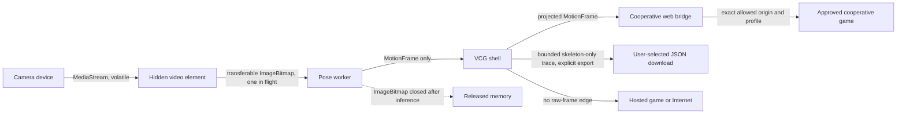

# VCG Console data flows

Status: browser prototype implemented; native appliance boundaries planned  
Last audited: 2026-07-22

This document maps camera frames, skeletons, profiles, saves, logs, and network calls across the current prototype and the selected appliance design. “Planned” is not an implementation claim. Every raw-frame guarantee must be requalified when the native tracker or another capture backend is added.

## Normal-mode trust boundaries

The browser main thread and pose worker are separate execution contexts, not separate security principals. Code executing with the console origin is trusted. An arbitrary hosted game runs as a separate supervised top-level origin in the selected design and receives no camera or Motion bridge access unless it qualifies for a cooperative, explicitly allowed integration.

## Data inventory

| Data | Source and path | Current storage and retention | Recipients | User control | Status |
|---|---|---|---|---|---|
| Raw camera pixels | Camera → `MediaStream` → hidden video → one transferable `ImageBitmap` → pose worker | Volatile browser/GPU memory only. The worker closes every accepted image in `finally`; dropped or late images are closed immediately. No application serialization path exists. | Trusted tracker main thread/worker only | Deliberate Start/Stop Camera; browser permission; future physical shutter | Implemented in browser prototype |
| Portable skeleton and actions | Pose result → MediaPipe adapter → Motion `0.3.0` frame → action engine/render/game | In-memory current frame plus a bounded 600-frame `TraceBuffer`; cleared on input-mode changes. No automatic persistent storage. | Shell, local obstacle game, and qualified cooperative game profiles | Camera stop; replay switch; explicit trace export | Implemented |
| Tracker health | Tracker lifecycle → ordered Motion `0.3.0` health event → shell/bridge/game | Current event in volatile host/session memory only; no provider exception text on the wire | Shell and exact-origin cooperative clients | Camera/replay control; independent controller/keyboard fallback | Implemented contract and browser demo |
| Rich/world skeleton extensions | MediaPipe adapter capability profiles | Same bounded in-memory treatment as the portable frame | No v1 game permission grants these profiles; bridge host also requires an explicit profile grant | A future manifest/Motion version plus reviewed host grant | Denied to games in v1 |
| Skeleton trace export | Bounded `MotionTrace` with `containsRawFrames: false` | Written only when the user activates Export; ordinary browser download retention then applies | User-selected local download | Explicit export action | Implemented |
| Profile name/selection | Launcher profile component | Svelte session memory only; lost on reload | Launcher shell | Create, rename, select | Prototype only |
| Portrait and body calibration | Future local capture/calibration flow | Planned encrypted device-local vault behind a deny-by-default broker; excluded from backup, diagnostics, games, and network | Profile/calibration broker only | Explicit capture/retake/confirm/delete; legal and consent gates remain | Not implemented |
| Game saves | Individual game runtime | Native planner derives bounded device-local per-game/owner/runtime save and cache namespaces, quotas, reset scope, migration staging, and profile-to-unassigned transitions; a separate host-only durable transaction can now execute/recover one exact confirmed save/cache reset | Owning game through a future sandbox/mount adapter and console lifecycle service | Per-game reset still needs deliberate controller/motion UI; factory reset remains planned | Contract and reset primitive implemented; storage broker/confinement not implemented |
| Runtime status and diagnostics | Launcher, tracker, bridge, supervisor, native host | Current UI status is volatile. Browser fault details contain stable codes and timings, not frames or identities. Bounded redacted native logs remain planned. | Local player/developer screen | Details disclosure; any future export requires deliberate consent | Partially implemented |
| Hosted game traffic | Supervised top-level browser process | Remote service policy applies; VCG must isolate per-game profile/storage and declare network need | Manifest-approved game origin | Launch disclosure and Exit | Browser supervisor spike only |
| Model, WASM, and shell assets | Console origin | Ordinary HTTP/browser cache behavior; these are code/assets, never camera samples | Local launcher/tracker | Update lifecycle | Implemented for development build |
| Motion bridge messages | Shell ↔ approved same-browser window using `postMessage` | Session map only; expired after silence or goodbye; one unacknowledged frame maximum | Exact allowed origin and source with negotiated projection | Game approval and launch lifecycle | Implemented cooperative path |

## Flow details and invariants

### Raw camera frames

1. `getUserMedia` requests `audio: false`; the microphone is never requested.
2. The hidden video element is a volatile capture source and is not attached as a visible recording surface.
3. Worker mode creates one `ImageBitmap` only after the one-frame gate accepts work. Transfer moves the bitmap to the worker rather than copying it into an application queue.
4. The worker calls `image.close()` in every initialized, uninitialized, success, and inference-failure path.
5. Main-thread fallback passes the video element directly to MediaPipe and never converts it to a blob, data URL, canvas image, file, request body, or storage value.
6. Only derived `MotionFrame` data returns from inference. The worker protocol has no raw-image response variant.

Invariant: normal mode has no application edge from raw pixels to persistence, a download, `postMessage` outside the tracker worker, or a network API.

### Skeleton and action data

The Motion frame is schema-validated at external boundaries. The local action engine enriches frames with standardized events. Rendering consumes landmark coordinates only. The cooperative bridge validates the exact source and origin, intersects tracker capabilities with an explicit host permission grant, negotiates required/optional profiles inside that grant, removes ungranted world/rich/action fields, limits publication, allows only one unacknowledged frame, and expires silent sessions.

Invariant: a cooperative game receives the smallest negotiated skeleton/action projection and never receives the camera source object.

### Profiles, portraits, and calibration

Current profile names are prototype session state. Portrait and automatic body-profile matching are intentionally absent. The selected future boundary keeps portrait pixels separate from appearance-free calibration features, requires visible confirmation before applying a predicted profile, and denies games direct vault access. Legal, child/privacy, consent, and real household tests remain explicit gates.

Invariant: profile UI copy must not imply durable encrypted storage until the native vault exists.

### Saves

No mutating console save broker exists yet. `save_lifecycle` now derives isolated host-owned paths, separate save/cache quotas, exact local reset scope, version-independent save namespaces, bounded migration staging, and explicit profile-to-unassigned/claim transitions for remote web, local web, native/Godot, and Libretro. Healthy updates and rollbacks preserve the namespace. Remote-web reset explicitly cannot affect hosted-service data. There is no console backup, export, migration to another console, or cloud sync. Storage loss and factory reset permanently remove saves.

Invariant: future save work must not reuse the profile vault or create a hidden network backup path.

### Logs and support evidence

Current tracker and launch status text is volatile. Skeleton trace export is a separate deliberate action and labels itself raw-frame-free. Future native logs must be bounded, redacted, device-local, and excluded from automatic cloud telemetry. Any support export requires an explicit review screen and consent.

Invariant: diagnostics must never silently add frames, portraits, calibration vectors, direct personal identifiers, credentials, or save contents.

### Network calls

The development shell loads its own JavaScript, WASM, and pose model with same-origin GET requests. Museum and hosted games are separate top-level experiences. The Motion bridge is browser `postMessage`, not a network transport. Native reachability checks and per-game network containment remain unimplemented.

Invariant: a hosted origin receives only its own browser traffic unless a reviewed manifest and explicit cooperative bridge grant a projected Motion profile.

## Normal-mode raw-frame egress audit

The automated Chrome flow starts the pinned local model with a synthetic camera, waits for derived traces, stops capture, and then asserts:

- no external-origin request occurred;
- no mutating HTTP request or request body occurred;
- no frame/image/video/pixels/blob query parameter occurred;
- local storage, session storage, IndexedDB, Cache Storage, and service-worker registrations remain empty;
- camera output still produced derived skeleton frames, proving the observation covered an active pipeline.

The source audit separately checks the only pixel-bearing protocol field (`ImageBitmap`), all `createImageBitmap`, Blob, object-URL, canvas, storage, network, and `postMessage` call sites. The only Blob/object-URL path serializes `MotionTraceSchema` output whose contract requires `containsRawFrames: false`.

### Failure audit

| Failure | Required behavior | Current evidence |
|---|---|---|
| Worker unavailable | Terminate failed worker and use visible main-thread fallback without persistence/egress | Browser fallback test |
| Worker inference/runtime fault | Release frame gate, stop capture tracks, clear video source, show fault | Source path and regression tests |
| Stop or page close | Stop all media tracks, clear video source, terminate worker on close | Tracker lifecycle implementation |
| Late prior-run worker message | Reject by run ID and current running state | Worker response guard |
| Backpressure | Drop new work rather than queue raw frames | `FrameGate` tests and one-frame transfer path |
| Explicit trace export | Export schema-validated skeleton/action JSON only | Motion trace schema and export implementation |
| Cooperative game disconnect | Clear/expire session and retain no queued frame stream | Bridge goodbye, acknowledgement, and TTL tests |

## Limits and requalification triggers

This audit does not prove what a browser, GPU driver, operating system, camera firmware, crash dump, swap implementation, developer tool, or compromised console-origin script may retain below the application boundary. It also does not qualify a real camera, the native Rust tracker, Hailo, ONNX Runtime, target Linux, or future portrait/calibration capture.

Re-run and extend I-134 before merging any change that adds a capture backend, screenshot/recording feature, raw-frame IPC, service worker, persistent browser store, telemetry, remote diagnostics, native crash dumps, portrait capture, or game-visible camera permission.
