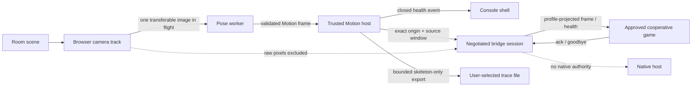

# Motion service and cooperative bridge security review

Last updated: 2026-07-24

This review closes the design artifact in I-083 for the current browser tracker and cooperative `postMessage` bridge. It does not claim that an approved origin is trustworthy forever, that browser policy contains hostile same-origin code, or that the future native Motion transport has been selected or qualified.

## Scope and trust assumptions

In scope:

- browser camera capture, worker inference, and derived Motion frames;
- tracker-health events, action enrichment, skeleton-only trace export;
- bridge hello/capability negotiation, sessions, health, frames, acknowledgements, disconnect, expiry, and reconnect;
- exact game and console origins plus their source windows.

Outside this implemented boundary:

- native tracker IPC and process isolation;
- release admission, emergency revocation, and supervised top-level browser lifecycle;
- OS camera permissions, GPU/driver memory, swap, crash dumps, extensions, and local administrator compromise;
- profile matching, portraits, saves, diagnostics export, and support tooling.

The console origin and its code are trusted. A cooperative game is trusted only to receive its reviewed profiles at one exact origin; it is not trusted with camera authority or console/native authority. The browser is trusted to enforce origin and `targetOrigin` semantics. Compromise of the console origin or an approved game's deployed same-origin code is a boundary failure requiring admission/revocation and browser containment, not something an origin allowlist can repair.

## Data flow

Raw images terminate inside the tracker boundary. The bridge accepts and emits schema-validated derived data only. Session IDs correlate one source window during one host lifetime but are neither authentication secrets nor launch authority.

## Security invariants

1. A non-allowlisted origin receives no reply, including no capability oracle.
2. Both origin and source-window identity must match; knowing a session ID is insufficient.
3. Hello binds bridge v2 and exact Motion API `0.4.0` before a session exists.
4. The host intersects source capabilities with an explicit manifest-derived
   profile grant before negotiation. Missing required profiles reject the
   session; optional profiles may degrade explicitly.
5. Frames are projected to granted profiles without fabricating landmarks, world data, or actions.
6. Current ordered health is sent at welcome and outside the frame stream; frame source/status must match it.
7. Health uses a closed reason/control vocabulary and carries no provider exception text.
8. One session has at most one unacknowledged frame; excess publication is dropped rather than queued.
9. Distinct sessions are bounded: default 16, configurable only from 1 through 64. A reconnect from an existing source may replace its own session at the bound.
10. Unknown additive fields are ignored, but known discriminators, versions, values, and cross-field rules remain strict.
11. Raw pixels, audio, camera controls, paths, native tokens, and profile/private-store authority are absent from the bridge schemas.

## Abuse cases and evidence

| Abuse case | Current behavior / mitigation | Evidence | Residual risk |
|---|---|---|---|
| Unapproved origin probes capabilities | Silently ignored before parsing | hostile-origin unit and cross-origin navigation tests | Browser defects; console-origin compromise |
| Origin suffix, wildcard, or path confusion | Configuration requires one exact path-free origin | constructor validation | Admission may approve the wrong exact deployment |
| Correct origin, wrong source window spoofs server health/frame | Client ignores it | sibling-window spoof test | Compromised configured console window |
| Sibling window steals session ID and sends goodbye | Host session remains because source does not match | stolen-goodbye test | Compromised original source window |
| Navigation changes an approved `WindowProxy` to a hostile origin | Inbound message is silent; exact outbound `targetOrigin` prevents delivery | real Chrome origin-drift test | Approved origin may later serve compromised code |
| Legacy/downgrade hello or welcome | Rejected/ignored before connection | bridge v1 and Motion `0.2.0` matrix | Actually released compatibility policy remains untested |
| Client requests richer profiles | Host capabilities are pre-filtered by an explicit grant; missing required profiles reject and optional profiles degrade | permission-grant and negotiation tests | Native/top-level launch still needs to construct this grant from signed package evidence |
| Rich/world/action data crosses an ungranted session | Frame projection removes it | projection and world-profile tests | New profiles need explicit projection review |
| Health spoof, stale sequence, or time regression | Exact source/session plus increasing sequence and non-regressing time | health-order tests | Host publisher compromise |
| Frame contradicts current tracker source or health | Host rejects before publication | source/status mismatch tests | Multiple future backends need an explicit multiplexing design |
| Provider exception leaks device/path detail | Wire health contains enums only | exact health schema and key-inventory test | Local operator diagnostics still need redaction review |
| Frame flood creates latency/memory queue | ACK gate plus per-session rate limit; 10,000-frame burst delivers one | burst/rate tests | CPU cost before caller reaches the bridge; native IPC unmeasured |
| Many allowlisted windows exhaust session memory | New distinct sessions fail explicitly at the configured bound | maximum-session test | Same-origin churn can still consume CPU and deny admission |
| Client stops acknowledging | Frames stop; session expires after bounded silence | expiry test | Expiry is exercised on publication, not an independent timer |
| Unknown fields bypass authority checks | Objects strip unknown additions; known/cross-field values stay strict | forward-compatible schema tests | A future field accidentally made authoritative without a version |
| Raw camera/audio reaches game | No bridge schema or host path accepts it | schema/data-flow audit and no-raw-frame Chrome test | OS/GPU/browser internals are outside application observation |
| Session ID used as native or launch authority | No bridge-to-native path; ID is map-local only | API/type/source audit | Future native integration must preserve this separation |
| Hostile same-origin game code handshakes legitimately | Not prevented; origin approval treats that deployment as trusted | explicit boundary statement | Requires version/origin-scoped admission, CSP, supervised lifecycle, and emergency revocation |

## Denial and lifecycle notes

The bridge bounds retained sessions and frame backlog, but it is not a general hostile-code sandbox. A valid approved origin can consume message-processing CPU, repeatedly reconnect, or monopolize the session bound. The future supervised browser lane must constrain process lifetime/resources and revoke changed deployments. A timer-driven idle-session policy is intentionally not invented here because an otherwise healthy connected game may receive no frames for an arbitrary interval; I-084 remains open for timed soak, real renderer stalls, memory telemetry, and native IPC.

## Remaining gates

- hostile same-origin, popup, nested-frame, pointer-lock, fullscreen, permission, download, and protocol-handler browser tests;
- version/origin-scoped admission and emergency revocation wired to launch;
- real long-running stalled-client and reconnect churn measurements;
- native transport selection, authentication, backpressure, and process isolation;
- OS/GPU/swap/crash inspection for raw or derived body data;
- redacted diagnostics/support export and retention;
- adversarial physical scenes that cause false join, Back, Pause, health, or player identity transitions.

Those remain under I-076, I-084, I-115, I-116, I-134, I-136, I-141, I-180, and I-208. Closing I-083 means the current boundary and abuse cases are documented and test-linked; it is not a production-security claim.
